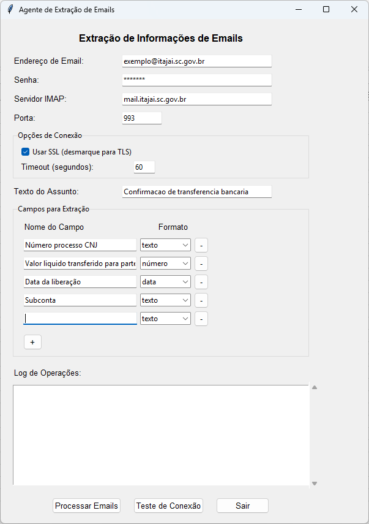

# Email Agente v1.0.0

Aplicativo para extração automática de informações de emails, como números de processos judiciais e valores monetários.



## Funcionalidades

- Conecta-se a servidores de email via IMAP (suporte a SSL e TLS)
- Busca emails não lidos com assunto específico
- Reconhecimento de caracteres especiais e acentos do idioma português
- Extrai informações de campos personalizáveis do conteúdo dos emails
- Suporta diferentes formatos de dados:
  - **Texto**: Extrai texto simples
  - **Número**: Converte valores numéricos do formato brasileiro (1.234,56) para formato decimal 
  - **Data**: Converte datas do formato brasileiro (dd/mm/aaaa) para o formato internacional
- Interface gráfica amigável com ajuste automático de tamanho
- Salva os dados extraídos em um arquivo Excel, mantendo os formatos apropriados
- Configurações persistentes para uso futuro

## Requisitos

- Windows
- Python 3.6 ou superior (para desenvolvimento)
- Ou simplesmente use o executável compilado

## Instalação

### Usar o executável compilado

1. Baixe o arquivo executável da [última versão](https://github.com/ricardopera/email-agente/releases/latest)
2. Execute o arquivo `EmailExtrator.exe`

### Para desenvolvedores

1. Clone este repositório
```
git clone https://github.com/ricardopera/email-agente.git
cd email-agente
```

2. Instale as dependências necessárias
```
pip install openpyxl pandas pyinstaller
```

3. Execute o aplicativo
```
python main.py
```

## Compilação do Executável

Para gerar um arquivo executável (.exe), use:

```
pyinstaller EmailExtrator.spec
```

O executável será gerado na pasta `dist`.

## Uso

1. Preencha os campos de:
   - Email e senha
   - Servidor IMAP (padrão: mail.itajai.sc.gov.br)
   - Porta (padrão: 993)
   - Timeout (aumentado para servidores mais lentos)
   - Texto a ser pesquisado no assunto dos emails

2. Configure os campos para extração:
   - Adicione campos com o botão "+"
   - Selecione o formato apropriado (texto, número, data) para cada campo
   - Remova campos desnecessários com o botão "-"

3. Use o botão "Teste de Conexão" para verificar se as configurações estão corretas
4. Clique em "Processar Emails" para buscar emails e extrair informações
5. Um arquivo Excel com os dados será gerado ao final do processamento

## Logging

O aplicativo gera logs detalhados no arquivo `email_extrator.log` que podem ser úteis para diagnosticar problemas de conexão.

## Novas funcionalidades na versão 1.0.0

- Suporte completo a caracteres acentuados e especiais do português
- Seleção de formato para cada campo extraído (texto, número, data)
- Conversão automática de valores monetários do formato brasileiro
- Conversão automática de datas para o formato internacional
- Ajuste automático do tamanho da janela ao adicionar/remover campos
- Melhorias na extração de dados dos emails

## Licença

Este projeto está licenciado sob a licença MIT.